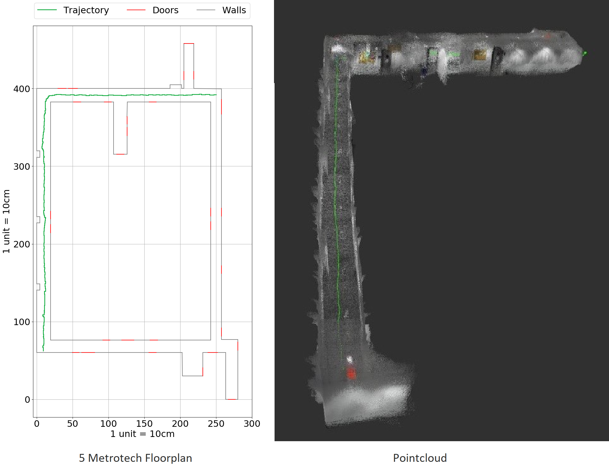

# Attention-Based-Visual-Odometry

In this project, we are developing a novel artificial neural network model that can be used to calculate visual odometry. The proposed model is a temporal-based attention neural network, the model takes in raw pixel and depth values from a camera and uses these inputs to generate feature vectors. The model then stores a history of the generated feature vectors, which allows it to take into account the temporal relationship between the current and past data points. 
The resulting output of the model is a prediction of the odometry value, which represents the movement of the camera or object. 
The proposed model has been tested in a variety of scenarios and has shown robust performance in unknown and cluttered environments.

## 💽 Dataset
### 7Scenes
The 7-Scenes dataset is a collection of tracked RGB-D camera frames.
To download the entire dataset follow [OFFICIAL LINK](https://www.microsoft.com/en-us/research/project/rgb-d-dataset-7-scenes/).

 
 :--:
  *7Scenes* 
[Download](https://drive.google.com/uc?export=download&id=1dhdH5g1XCGnFbvOj5OOUY3YHaCO4RIIf) 7Scenes dataset having "heads" sequence

### NYU sparse dataset
Similarly, NYU sparse dataset is a collection of tracked RGB-D camera frames in featureless environment of 5 Metrotech.

 :--:
  
 
 :--:
  *NYU Sparse Dataset*
[Download](https://drive.google.com/uc?export=download&id=1dhdH5g1XCGnFbvOj5OOUY3YHaCO4RIIf) NYU sparse dataset
[Download](https://drive.google.com/uc?export=download&id=1H_JrvroG4v_MMUqWKM0P57lNYYE2droc) NYU sparse dataset(ROS bag file)


## ⚙️ Setup

1. Install all the requirements (PyTorch v1.13.0)
```shell
pip3 install torch torchvision torchaudio torchinfo tensorboard matplotlib numpy pandas opencv-python 
```
2. Clone the GitHub repository
```shell
git clone https://github.com/navoday01/Attention-Based-Visual-Odometry.git
```
3. [Download](https://drive.google.com/uc?export=download&id=1dhdH5g1XCGnFbvOj5OOUY3YHaCO4RIIf) Model and paste inside Attention-Based-Visual-Odometry folder.

## 📉 Tensorboard
To view the losses use Tensorboard to visualize the graphs
```shell
tensorboard --logdir runs/
```

## ⏳ Training
Run train script `training.py` to recreate similar model.
```shell
python3 training.py <Path to 7Scenes dataset folder> <Scene for Training>
```
example: python3 training.py /home/7scenes heads
## 🖼 Testing

 To test the model, run `test.py` and the predicited camera poses along with the actual camera poses get saved as a .csv file. The .csv file can be used to vizualize the camera trajectory.
```shell
python3 test.py <Path to 7Scenes dataset folder> <Scene for Testing>
```
example: python3 test.py /home/7scenes heads

To test the model for the NYU sparse dataset
```shell
python3 test.py <Path to 7Scenes dataset folder> 5metrotech
```


## 📊 Results

 
 :--:
  *Losses* 


 :--:
  *Trajectory* 

### Benchmarks
| **Scene** |   **SCoRe Forest**    |  **DSAC**  |  **VLocNet++**  |  **NNnet**  |  **PoseNet2**  |  **Ours**  |
|:--------:|:------------------:|:----------------------------:|:------------:|:----------:|:-------------:|:-------------:|
|  Chess |  0.03m, **0.66°**     |     0.03m, **0.66°**       |    **0.0018m**, 1.17°    |   0.13m, 6.66°  |  0.13m, 4.48°    | 0.01m, 3.35° |
|  Fire  |  0.05m, 1.50° |     0.04m, 1.50°       |    **0.009m**, **0.61°**  |   0.26m, 12.72°  |  0.27m, 11.28°    | 0.013m, 2.55°    |
|  Heads |  0.06m, 5.50°    |     0.03m, 2.70°       |    **0.008m**, **0.60°**     |  0.14m, 12.34°  |  0.17m, 13.00°    |  0.009m, 1.03°         |
| Office |  0.04m, 0.78°    |     0.04m, 1.60°    |    0.016m, 0.78°     |   0.21m, 7.35°  |  0.19m, 5.35°     | **0.014m**, **0.77°**           |
| Pumpkin|  0.04m, **0.68°**   |     0.05m, 2.00°   |    0.009m, 0.82°   |   0.24m, 6.35°  |  0.26m, 4.75°     | **0.008m**, 0.75°           |
|RedKitchen|  0.04m, **0.76°**      |     0.05m, 2.00°    |    **0.0017m**, 0.93°   |   0.24m, 8.03°  |  0.23m, 5.35°    |  0.21m, 4.34°        |
|  Stairs  |  0.32m, 1.32°      |     1.17m, 33.1°    |   **0.010m**, **0.48°**   |   0.27m, 11.28°  |  0.35m, 12.4°    |  0.011m, 2.89°        |

## 📦 Conclusion

A temporal attention (TA) network was created to calculate the visual odometry of the most recent frame using a set of previous frames.

A new dataset called the NYU sparse dataset was created for testing the performance of a visual odometry algorithm in sparse feature environments. The network being tested showed promising results on this dataset and a separate dataset as well. The model's robust performance can be attributed to the fact that the Depth Maps are not being computed but metric Depth Map are taken directly from the dataset, doing this eliminates the scale requirement as it is already encoded in the Depth Map. 

The intent of this project was to create a TA network which was accomplished, further training and testing was conducted on a dataset used in VO benchmarks. Our other goal was to test the model against other state of the art algorithms, to see where it stands. Additionally, the last deliverable was to create a sparse featureless dataset which was also accomplished successfully.

## 👩‍⚖️ Acknowledgement

We express our gratitude to the all the authors, who have worked hard to engineer such effective solutions for visual odometry. We would like to thank everyone whose comments and suggestions helped us with the project. We express our sincere gratitude to Professors Chinmay Hegde, Arsalan Mosenia, and the teaching assistant Teal Witter. 
